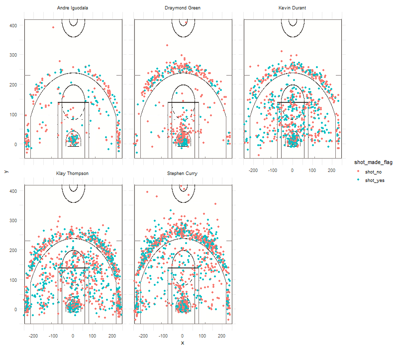

workout01-warren-gu
================
Warren Gu
March 10, 2019

The Golden State Warriors: Who are the Real Warriors?
=====================================================

It is no secret that the Golden State Warriors have been back to back NBA champions in the last two seasons. However, there are those who sweat blood and tears to work their way to this position; then there are those who found success by riding on the coat tails on others. Today, I will attempt to tear off the mask that certain members of the Warriors. It is time to find out who are the players putting their team mates on their back, and those who are the obnoxious low level for fun players ridiculing their opponents while hiding behind their team mates.

### Sharpshooters: Effective Shooting Percentage

Let us first take a look at the overall effective shooting percentage of five certain Warriors. I have singled out these five players as a result of extensive analysis as part of another project that I am currently working on, so the rest of this article will be restricted to these five players:

-   Andre Iguodala
-   Draymond Green
-   Kevin Durant
-   Klay Thompson
-   Stephen Curry

For my analysis, I split up the effective shooting percentage into three different tables:

-   Overall effective shooting percentage
-   2 point effective shooting percentage
-   3 point effective shooting percentage

Now for all of you video game players who have never seen a basketball game, please be aware that players can either score 2 points or 3 points in a basketball game. Our overall table combines both 2 point shots and 3 point shots.

| name           |  total|  made|  percentage|
|:---------------|------:|-----:|-----------:|
| Andre Iguodala |    210|   134|   0.6380952|
| Kevin Durant   |    643|   390|   0.6065319|
| Stephen Curry  |    563|   304|   0.5399645|
| Klay Thompson  |    640|   329|   0.5140625|
| Draymond Green |    346|   171|   0.4942197|

As we can see from this two point effective shot percentage table, it is apparent that Andre Iguodala is the most effective player if we look purely at the percentage. However, this is a common mistake by the inexperienced public to only focus on one value. If we also look at the total shots made, we see that Andre Iguodala has made almost $\\frac{1}{3}$ of the shots that Kevin Durant has! This implies two possible scenarios:

1.  Andre Iguodala is a fantastic two point shooter who is not given enough opportunities to wreck his opponents because his team mates are always in control of the ball.
2.  Andre Iguodala only appears as a great shooter because he did not make as many shots as his team mates.

Do you see the problem here? We can draw very different conclusions from looking at this table, but there is no easy way to determine which is the correct conclusion. We cannot go back in time to experiment with having Andre Iguodala shoot more, and we cannot directly use his performance in the current season since factors such as age and injuries may cause his current performance to differ from his previous performance. It seems that determining which Warrior is the real deal is starting to seem harder than what I first expected.

| name           |  total|  made|  percentage|
|:---------------|------:|-----:|-----------:|
| Klay Thompson  |    580|   246|   0.4241379|
| Stephen Curry  |    687|   280|   0.4075691|
| Kevin Durant   |    272|   105|   0.3860294|
| Andre Iguodala |    161|    58|   0.3602484|
| Draymond Green |    232|    74|   0.3189655|

On the other hand, the 3 point effective shot percentage table tells a very different story! Andre Iguodala switches places with Klay Thompson as Andre now ranks fourth out of the five players. What is even more impressive with Klay Thompson is that Klay is taking more than triple the shots than Andre, and Klay is still making more of his shots. Now, you may be crying out that I am biased against Andre since one can easily make the argument that Andre could have improved his 3 point effective shot percentage by making more 3 point shots. However, I would like to point out there exists a 6 percentage difference between Klay and Andre's 3 point effective shot percentage. Such a difference is generally very hard to attribute to chance especially when both players have made over 200 shots. Sorry Andre, but you have to admit that you are worse 3 point shooter than "Hot Hands" Klay.

| name           |  total|  made|  percentage|
|:---------------|------:|-----:|-----------:|
| Kevin Durant   |    915|   495|   0.5409836|
| Andre Iguodala |    371|   192|   0.5175202|
| Klay Thompson  |   1220|   575|   0.4713115|
| Stephen Curry  |   1250|   584|   0.4672000|
| Draymond Green |    578|   245|   0.4238754|

Aha! I think we have found the culprit and the true carry in the Golden State Warriors! It is obvious that Kevin Durant is the star player with the highest overall effective shooting percentage while Draymond Green clearly is coasting on his team mates' success! It is a little surprising that Kevin Durant is overall ranked the highest since he does not rank as the highest in the two point and three point effective shooting percentage. However, Kevin's steady performance in two point shots was able to push him to the top. However, it is no surprise that Draymond Green is overall the least effective shooter considering he is ranked the lowest in both two point and three point effective shooting percentage. Consider the following shot charts:

It is clear from the chart that Draymond Green makes less shots than his four other team mates in addition to his lack of success when shooting. Even Andre Iguodala has less red missed shots than Draymond Green even though Andre has made less shots than Draymond. Could it be that the removal of Draymond Green would make the Warriors even more formidable?

### Not so Fast...

After all of our analysis, it appears that we have made a fatal error. A Warrior must be strong in both offense *and defense* to be considered a true Warrior. The analysis of shots made only covers the offensive capability of our five Warriors. While it is clear that Kevin Durant dominates Draymond Green offensively, ourdata neglected the defense provided by Draymond Green in both of Warrior's championship runs. It is clear that there is a reason Draymond Green won the NBA Defensive Player of the Year in 2017. Removing Draymond Green would not boost the Warrior's performance; it would only lead to the Warriors' downfall. In our quest to determine the true worth of a Warrior, we were instead blinded to one side for the most part. Let that be a lesson as we move forward: numbers do not lie, but the person who weaves together the statistics can present a view far from the truth.
